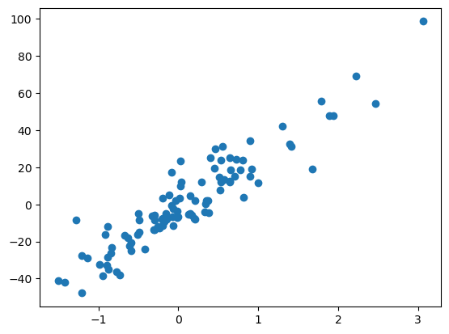
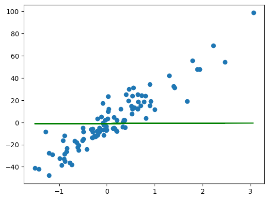
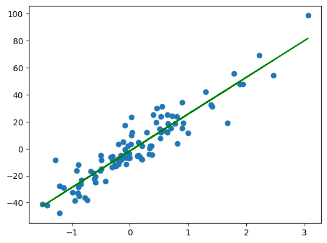

# Linear Regression


```python
import numpy as np
from sklearn.datasets import make_regression
import matplotlib.pyplot as plt
```

# 1. Dataset


```python
x,y = make_regression(n_samples = 100 , n_features = 1 , noise = 10)
plt.scatter(x,y)
```


    <matplotlib.collections.PathCollection at 0x1e1178515d0>


    

    


```python
y = y.reshape(y.shape[0],1)
#dimensions verification
print(x.shape,y.shape)
```

    (100, 1) (100, 1)
    


```python
X = np.hstack((x, np.ones(x.shape)))
#dimensions verification
print(X.shape)
```

    (100, 2)
    


```python
theta = np.random.randn(2,1)
#dimensions verification
print(theta.shape)
```

    (2, 1)
    

# 2. Model


```python
def model(X,theta):
    return X.dot(theta)
```


```python
plt.plot(x,model(X,theta),c='g')
plt.scatter(x,y)
```


    <matplotlib.collections.PathCollection at 0x1e1178c9850>


    

    


# 3. Cost Function


```python
def cost_function(X , theta , y) :
    m = len(y)
    return (1 / (2 * m)) * np.sum((model(X , theta) - y) ** 2)
```


```python
cost_function(X , theta , y)
```


    310.40572012509364


# 4. Normal Equations


```python
def normalMethod(X, y):
    P1 = X.T.dot(X)
    P2 = X.T.dot(y)
    return np.linalg.inv(P1).dot(P2)
```


```python
theta_final = normalMethod(X,y)
```


```python
plt.scatter(x,y)
predection = model(X,theta_final) 
plt.plot(x,predection,c='g')
```


    [<matplotlib.lines.Line2D at 0x1e1157e9dd0>]


    

    


```python
def determination_coef(y , pred) :
    u = ((y - pred) ** 2).sum()
    v = ((y - y.mean()) ** 2).sum()
    return 1 - (u / v)
```


```python
determination_coef(y , predection)
```


    0.8620102910745685


