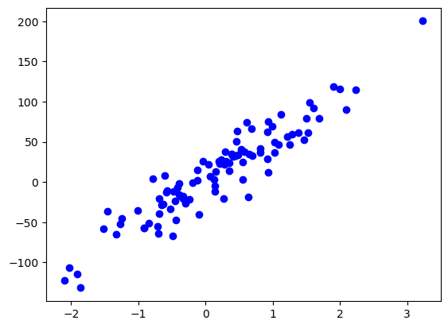

# Linear Regression


```python
import numpy as np
from sklearn.datasets import make_regression
import matplotlib.pyplot as plt
```

# 1. Dataset


```python
x,y = make_regression(n_samples = 100 , n_features = 2 , noise = 10)

```


```python
plt.scatter(x[:,1],y,c='y')
```


    <matplotlib.collections.PathCollection at 0x26fd9b5f010>


    

    


```python
plt.scatter(x[:,0],y,c='b')
```


    <matplotlib.collections.PathCollection at 0x26fda4dfe50>


    

    


```python
y = y.reshape(y.shape[0],1)
#dimensions verification
print(x.shape,y.shape)
```

    (100, 2) (100, 1)
    


```python
X = np.hstack((x, np.ones((x.shape[0], 1))))
#dimensions verification
print(X.shape)

```

    (100, 3)
    


```python
theta = np.random.randn(3,1)
#dimensions verification
print(theta.shape)
```

    (3, 1)
    

# 2. Model


```python
def model(X,theta):
    return X.dot(theta)
```


```python
plt.scatter(x[:,0],model(X,theta),c='g')
plt.scatter(x[:,0],y)
```


    <matplotlib.collections.PathCollection at 0x26fda5751d0>


    

    


```python
plt.scatter(x[:,1],model(X,theta),c='y')
plt.scatter(x[:,1],y)
```


    <matplotlib.collections.PathCollection at 0x26fdb6f1210>


    

    


# 3. Cost Function


```python
def cost_function(X , theta , y) :
    m = len(y)
    return (1 / (2 * m)) * np.sum((model(X , theta) - y) ** 2)
```


```python
cost_function(X , theta , y)
```


    1595.5498773865215


# 4. Gradient Descent


```python
def grad(X, y, theta):
    m = len(y)
    return (1 / m) * (X.T.dot(model(X, theta) - y))

```


```python
def gradient_descent(X, y, theta, l_rate, n):
    cost_history = np.zeros(n)
    for i in range(n):
        theta = theta - l_rate * grad(X, y, theta)
        cost_history[i] = cost_function(X , theta , y)
    return theta , cost_history
```


```python
theta_final , cost_history = gradient_descent(X, y, theta, l_rate=0.01, n=1000)
#dimensions verification
print(theta_final.shape)  
```

    (3, 1)
    


```python
predection = model(X,theta_final) 

```


```python
plt.scatter(x[:,0],y)
plt.scatter(x[:,0],predection,c='g')
```


    <matplotlib.collections.PathCollection at 0x26fdb8a3050>


    

    


```python
plt.scatter(x[:,1],y)
plt.scatter(x[:,1],predection,c='g')
```


    <matplotlib.collections.PathCollection at 0x26fdb91d990>


    

    


```python
plt.plot(range(1000),cost_history)
```


    [<matplotlib.lines.Line2D at 0x26fdb7f1b50>]


    

    


```python
def determination_coef(y , pred) :
    u = ((y - pred) ** 2).sum()
    v = ((y - y.mean()) ** 2).sum()
    return 1 - (u / v)
```


```python
determination_coef(y , predection)
```


    0.9714230605751063


